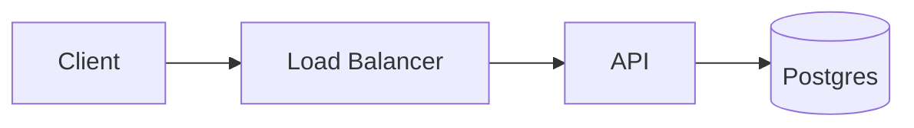

# 6 · Cloze, dual-direction, image & diagram cards

Three extensions to the basic card, each a small addition on top of the format
from chapter 3.

## Cloze cards: fill in the blank

A cloze card hides part of the answer; you create one by wrapping the hidden
text in `\blank{...}`.

Wrap any span of an answer in `\blank{...}` and the card becomes a **cloze**: each
`\blank{...}` is a blank, and the card expands into one sub-card per blank. No
directive is needed; the marker itself is the trigger.

```
## Complete the Rust declaration
let \blank{mut} x: \blank{u64} = 0;
```

This makes two cards. One blanks `mut` and shows the rest; the other blanks `u64`.
The asked blank is marked apart from the *other* blanks, which are hidden as `⬚`, so no card
gives away its siblings' answers. You only produce the hidden text. The web app
draws both as chips rather than showing the glyphs themselves.

Braces outside a `\blank{}` are ordinary text, so `let p = Foo {};` is fine in a
cloze answer. If you need a literal brace *inside* a `\blank{...}`, escape it as
`\{` or `\}`.

`alix` keeps a card's cloze siblings apart in the queue when other cards are
available, so you don't see `mut` right after `u64`. Editing is safe: identity is
the card's token (chapter 3), so rewording the question, or a hole's text, keeps
your history.

Reach for cloze when the *context* is the cue: a definition with its key term
removed, a line of code with the operative token blanked.

A blank inside `$...$` or `$$...$$` is a piece of the formula, and is treated
as one. It reveals typeset (`$x = -b \blank{\pm} \sqrt{d}$` shows ±, not the
characters `\pm`), and at Reconstruct it is **sketched rather than typed**,
since a formula's piece has no keyboard spelling. Write `input: type` on the
card or the deck to keep the keyboard: an authored `input:` always wins, and
the rule only fills in where you said nothing. `alix doctor` warns when a hole
that stays typed holds a LaTeX command, since `\blank{\pm}` then asks for the
spelling of `\pm` rather than for the sign.

### A note for one blank

A `>` note belongs to the card you wrote, so every blank of it shows the same
note, and a note that spells out one blank's answer gives it away on all the
others. Name the blank you mean and write the note to that name:

```
## The test pyramid, bottom to top
\blank[base]{Unit}, \blank{integration}, \blank{end-to-end}
> [!NOTE]
> base: Fastest and most numerous, which is why they sit at the bottom.
```

Only the `Unit` card shows that line; the other two show nothing. Written as
`> base+: ...` it is added below the shared note instead of replacing it. A
name is one or more of `a-z`, `A-Z`, `0-9`, `_` or `-`, and two blanks of one
card can't share it.

Everything else stays prose. A note line is only an address when the card
names a blank and the name before the `:` is one of them, so a note that opens
`2: the second one` is still a note. `alix doctor` reports an address that
names no blank of its card, and shows the line as an ordinary note.

### Blanks that belong together

Give two blanks the *same* name and they become one card asking both, instead
of two cards each asking half a fact:

```
## The TCP three-way handshake, in order
\blank[open]{SYN}, \blank[open]{SYN-ACK}, \blank{ACK}
```

That is two cards, not three: one asking `SYN` and `SYN-ACK` together, one
asking `ACK`. Both spans show as `⍰` on the merged card, and you answer them
as a list, one line per span. They don't have to sit next to each other or even
on the same line, so `\blank[c]{Berlin} is the capital of \blank[c]{Germany}`
groups too.

**Grouping starts that card's history over.** Two spans recalled together are a
harder question than either alone, so the merged card takes no schedule from
the blanks it replaces: it comes back as if it were new. The blanks you did
*not* group keep their history, even though grouping renumbered them. Group
early if you are going to.

**A name addresses a blank; it is not its id.** Identity is the card's token
(chapter 3), so renaming a blank, or adding a name to one you have already
drilled, keeps your history exactly as rewording the question does. The name
means nothing outside the card it is written in: two cards may each have a
`base`.

## Dual-direction cards: `direction:`

Reviewing a card *both ways* is what you want for vocabulary and other reversible
facts. Set it per card with `<!-- direction: both -->`, or deck-wide with a
`direction:` line in the frontmatter:

```
## purported
angeblich
<!-- direction: both -->
```

- `both` makes two cards: `purported` → `angeblich` and the swap `angeblich` →
  `purported`.
- `reverse` keeps only the swapped one.
- `forward` (the default) is the card as written.

The two directions get **distinct progress**, are kept apart in the queue, and are
removed together; the reversed card keeps the note. It's best for single-line
cards, and it doesn't apply to cloze cards. When a reversed card's question side
comes from several answer lines, they render as separate centred lines rather than
running together.

## Image cards

Write a standard Markdown image on its own line, and its position decides
the side: an image in the question is a front image, one in the answer is a
back image, and a card can carry more than one per side. An image sharing a
line with prose is rejected: alix displays images as media beside the text,
not inline within a sentence, so a mixed line would silently lose its shape.

A front image sits between the heading and the divider, so the front has more
than the heading line and the divider needs a blank line above it. Attached
directly under a content line the break is in no valid position and fails
loudly, naming the line:

```
## What phase is the moon in?


---
Waxing gibbous

## Play this chord:
G major

---
The open-position shape.

```

For a deck on its own, an image `src` is a path relative to the deck file,
exactly the way a standard Markdown viewer resolves it: a bare filename means
the image sits next to the deck, and `sub/moon.png` means a subdirectory. An
absolute path is used as-is. The brackets can carry alt text:
``. Because the paths are ordinary
Markdown, such a deck renders identically in the web app and in any Markdown
viewer that opens the file directly (GitHub, Obsidian, a plain preview pane).
`alix doctor` warns about an image file it can't find, but doesn't fail on it.

Inside a [workspace](08-workspaces.md) the base is the **workspace root**, the
folder holding `alix.toml`, not the `decks/` folder the member sits in. So a
bare `` in `decks/phases.md` means `moon.png` beside `alix.toml`.
Initializing the member then copies each local image into the deck's own
`assets/deck-<token>/` under its SHA-256 name and rewrites the reference to
point there, which is what makes the member shareable and what keeps it
working on a machine that never had the original.

## Image occlusion: `blank:`, `cover:` & `crop:`

A card can hide a region of its picture and ask what is under it. A region is
a directive comment on its own line beneath the image it marks, so any other
Markdown viewer still shows the plain picture:

```
## Name the quadrant colors

<!-- blank: rect x=10% y=10% width=35% height=35% hidden="red" -->
<!-- blank: rect x=55% y=10% width=35% height=35% hidden="green" -->
<!-- cover: rect x=10% y=60% width=35% height=35% -->
```

Each directive names its shape first: `rect` is the shape word, and the only
image shape today (`span`, below, is the text shape). Three keywords, one
concept each:

- **`blank:`** masks a region and asks about it, the same idea as a text
  `\blank{...}` in picture form. `hidden="..."` is the expected answer.
- **`cover:`** masks a region and never asks: for a legend or label that would
  give an answer away. It creates no card; a `hidden=` on it is kept but
  inert, so switching a region between `blank:` and `cover:` never loses
  your answer text.
- **`crop:`** shows only a viewport of the source, so one large picture can
  serve many cards without being cut into files:
  `<!-- crop: rect x=50% y=0% width=50% height=100% -->` shows the right
  half. At most one per image, and region coordinates stay in the *full
  source's* space, never crop space, so adjusting the crop moves no region.

Fields are named, so their order never matters. Bare numbers are pixels in the
source image's own coordinates (what a paint tool hands you); a `%` suffix on
a number makes it a percentage of the full source. Every region and the crop
on one image must agree on the unit. A region may reach past the image's edge
and is clipped there when drawn; only a `blank:` whose region contains nothing
visible at all is refused, because a question about nothing visible is broken
(percentage geometry is checked when the deck loads, pixel geometry at render
time, since only the app showing the file knows its size).

**A block with a `blank:` is a template, exactly like a cloze block**: it
produces one card per blank and nothing else, and each sibling card masks the
others' regions so no answer leaks. In review the roles look different on
purpose: the region you are asked about shows the `⍰` blank marker, a sibling
card's masked region shows `⬚`, and a cover is a plain fill with no marker,
telling you it is never a question. Masks lift on reveal exactly like text
blanks; a cover keeps hiding on region and cloze cards (its content could give
a sibling's answer away), and reveals with the answer on an ordinary card that
poses no such sibling questions. Removing the last `blank:` turns the block
back into its plain card, review history intact. `cover:` or `crop:` alone
change only the display; the ordinary card remains.

Blanks that belong together take a bracketed group name, the same idea as
cloze groups and with the same warning, a regrouped card starts its history
over:

```
<!-- blank: rect x=10 y=40 width=80 height=30 hidden="mitochondrion" [organelles] -->
<!-- blank: rect x=10 y=90 width=80 height=30 hidden="nucleus" [organelles] -->
```

When you open a deck for review, alix stamps each region with a short
`b:<tag>` mark, exactly like the card ids from
[the deck format](03-the-deck-format.md): minted once, never hand-written,
and what keeps a region's review history attached while you nudge its
coordinates or reword its answer.

## Stored text blanks: `blank: span`

The same directive blanks *text* without touching the sentence. Where an
inline `\blank{...}` rewrites the answer line, a `span` names its target from
a comment below the block, so the text stays clean for every other reader:

```
## The powerhouse line
The mitochondrion is the powerhouse of the cell.
<!-- blank: span hidden="mitochondrion" -->
```

`hidden="..."` is both the anchor and the answer: alix finds that text in the
block and masks it. `cover: span hidden="..."` hides its text the same way
without ever asking. Two optional keys refine the match:

- **`occurrence=N`** (default 1): mask the Nth occurrence of the hidden text,
  counted over the block in order. Fewer than N occurrences is an error;
  nothing silently moves.
- **`boundary=word|char`** (default `word`): `word` requires the match to
  stand alone (punctuation next to it is fine); `char` matches anywhere, for
  sub-word blanks like `hidden="mito"`.

On first review alix also mints a `position:<n>` anchor into the directive,
the point where the span bound (counted in characters as you see them, so the
number survives any script). Review never reads it; it is the drift signal.
When you later edit the block and the hidden text moves, `alix doctor`
reports the divergence with both readings and the exact edit for each: keep
the text you authored (run `alix doctor <deck> --repair-positions` and the
anchor is rewritten to where the span binds today), accept the new binding by
writing that `position:` in yourself, or keep the old target by setting
`occurrence=` (offered only when the region carries a minted occurrence to
name). Doctor never rewrites a diverged span on its own.

A span may sit inside a formula. Its hidden text must then be a complete
structural unit of the math: no half of a `\command`, no split `{...}` group,
no structural characters inside the match (`&` and `\\`, LaTeX's column and
row separators), and alix proves the formula still renders with the span
masked; a violation is a loud error naming the offending piece of the
formula when the deck loads. A masked formula draws the blank as a boxed
hole (the same form cloze holes in math already use), and a span whose
answer needs LaTeX to type gets the same doctor warning a cloze hole gets
when the block pins `input: type`.

## Mermaid diagrams

A fenced ```` ```mermaid ```` block in a card renders as a diagram. alix does
not draw mermaid itself: when a **workspace member** is initialized
(`alix deck init`, the same step that freezes local images and cited source
excerpts, both covered below and in [Workspaces](08-workspaces.md)), each
fence is rendered once through **sekien**, an optional external CLI that
runs real mermaid.js (`cargo install sekien`), rasterized, and stored in the
deck's asset folder (`assets/deck-<token>/` under the workspace) as a
content-addressed image plus a label map: where every node and edge label
sits in the picture, which is what masking uses later. A machine-managed
stamp comment lands on the line after the fence, tying the fence text to
those two frozen files:

```
<!-- diagram: fingerprint: xxh64-… asset: sha256-….png geometry: sha256-….json -->
```

From then on every client shows the image, including the mobile app
offline; the mermaid source stays the only thing you edit.

````
## the request path

````

Diagrams never make `deck init` fail. Whatever goes wrong, initializing
finishes and tells you: without sekien installed the deck initializes and
warns, and the fence shows as a plain code block until you install the
renderer and re-run `alix deck init`; a fence sekien cannot render, or a
theme whose colors alix cannot read (below), is reported the same way and
that one diagram stays unfrozen. A standalone deck (no workspace) always
shows source: freezing needs the workspace's asset store.

Editing a frozen fence makes its stamp stale, and the fence falls back to
its source until the next `deck init` re-freezes it. Fallback always means
the same thing: the fence displays as a code block instead of a picture;
on a masking card (below) the hidden text inside it is blanked, so the
card stays reviewable either way. When a session opens on a deck with a
stamped diagram that cannot be loaded (a stale stamp, a missing frozen
file, or a geometry file that does not read back), the app shows a one-line
warning so the fallback is never mistaken for a successful freeze. One
kind of damage is deliberately outside that check: loading verifies
shapes, not bytes, so a frozen file whose content was corrupted in place
(bytes that no longer match their content-addressed name, after a faulty
copy or restore) still serves. `alix doctor` is what re-hashes every
frozen object and names such a file. `alix doctor <deck>
--repair-diagrams` removes stamps that lost their fence and re-freezes
stale or unfrozen ones; the corrupt-bytes case is repaired by deleting
the stamp line and re-running `alix deck init`.

### Theming

The diagram's colors are decided by its **own source**, at freeze time:

- an init directive on the fence's first line:
  `%%{init: {"theme": "dark"}}%%`, or
- mermaid's YAML frontmatter at the top of the fence:

  ```
  ---
  config:
    theme: forest
  ---
  ```

An in-fence theme wins over anything set outside the fence (sekien's own
`--theme` flag included), so a shared deck renders the same everywhere.
alix reads the rendered theme's text color and puts the raster on
whichever background, light or dark, keeps that text readable. The
trade-off to know about: colors are **baked in when you freeze**. A frozen
diagram does not follow the app's light/dark theme, and re-theming means
editing the fence and re-freezing.

### Masking diagram labels

The span directives from the previous section work on diagram source, and
on a frozen diagram they mask **on the rendered image**:

````
## the request path

<!-- blank: span hidden="Load Balancer" -->
````

The card shows the diagram with a mask over the Load Balancer node's
label; the mask lifts when the answer shows. Sibling blanks and covers on
the same fence stay masked, exactly like image occlusion, and a reader
using assistive technology hears only the visible labels, never the
hidden ones.

A span must cover **one complete visible label**. Node and edge labels can
be masked; node ids, arrows, and keywords never can, and a span whose
hidden text lands on one is reported by `alix doctor` while the card falls
back to masked source (reviewable, just not drawn). Where the same text
appears more than once, `occurrence=` picks which one, counted over the
block like any span. A bare node like `A`, whose label is its id, masks
like any other label. Some labels still cannot be masked, and doctor says
so when a span targets them: labels whose rendered text is not literally
in the source (multi-line `<br/>` labels, HTML entities), and a bare node
the fence references on more than one line, where which occurrence is
"the" label is ambiguous (write `A[A]` once to settle it).

## Source citations

A plain fact card can show *where its answer comes from*. Declare the deck's source
with a `source:` line in the frontmatter, give the card an `<!-- at: ... -->`
locator into it, and on reveal the card offers to swap the worded answer for the
exact source lines:

```
---
source: src/string.rs
---

## What does the `String` struct hold?
A `Vec<u8>` (its bytes).
<!-- at: src/string.rs:1-3 fingerprint: xxh64-0123456789abcdef -->
```

The locator is the same shape a [trace checkpoint](13-trace-decks.md) uses. Its
fields are named and ordered: `at:` is the source path and line range (e.g.
`src/string.rs:1-3`, just `lines` when `source:` is a single file, or a
range-less path or URL to cite the whole source, the form a frozen URL
source uses), and
`fingerprint:` is an `xxh64-<hex>` digest of the displayed source text. alix
writes the fingerprint when it creates a cited card or when you explicitly
repair a hand-authored citation. A fact card may repeat the whole directive when
its answer rests on several disjoint source ranges:

```markdown
<!-- at: src/state.rs:64-74 fingerprint: xxh64-0123456789abcdef -->
<!-- at: src/state.rs:114-118 fingerprint: xxh64-123456789abcdef0 -->
<!-- at: src/state.rs:152-158 fingerprint: xxh64-23456789abcdef01 -->
```

Each locator remains one contiguous range; separate directives never imply
that disjoint code is adjacent. On reveal a `</>` marker appears on the answer:
**click the answer** (or press `s`) to swap it for the same editor-style source
panels used by trace walks, and back. Multiple excerpts are stacked in authored
order inside the one scrollable answer region. For a live citation, alix shows
the lines only when their fingerprint still matches. A moved, changed, deleted,
ambiguous, or unfingerprinted excerpt shows a warning instead of unrelated
lines, without hiding the other citations. Short evidence keeps the answer's
centered vertical alignment; long evidence aligns to the top and scrolls.

This is the same machinery trace walks use to reveal source, brought to ordinary
fact cards. Like every directive, `<!-- at: -->` is not part of a card's identity:
adding a citation never resets its progress.

You rarely write these by hand. Generating a deck from a local source
([`alix deck generate <path>`](11-generating-decks.md)) cites the lines each fact came
from and fingerprints every citation. Plain
[`alix doctor`](17-command-reference.md) reports missing fingerprints and
fingerprint drift without writing. After reviewing the cited text,
`alix doctor <deck> --repair-source-locators` stamps a missing fingerprint or
rebases a uniquely relocated exact excerpt; changed or ambiguous excerpts
remain untouched for semantic review. Initializing a workspace member goes one
further and **freezes** its source evidence and local images below
`assets/deck-<token>/`, so the deck travels without the original source and the
quotes never shift. Freezing stores only the cited excerpt, never the whole
file, and leaves the deck's `source:` pointed at the real material: each frozen
citation keeps its real path in `at:` and gains an `asset:` field naming the
content-addressed object, so a drift check can still compare against the live
source when it is reachable.
